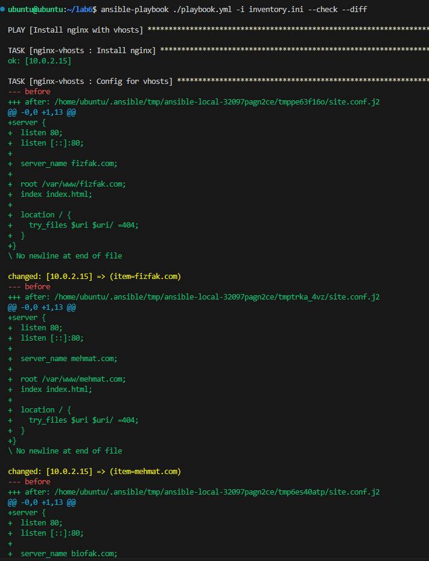
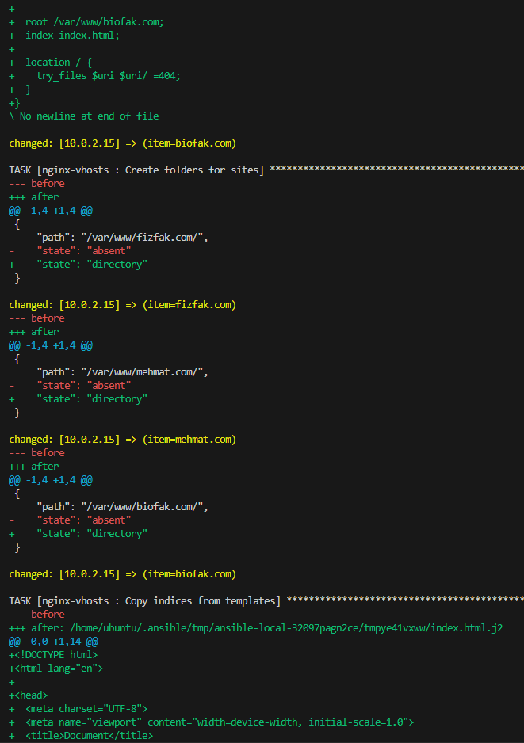
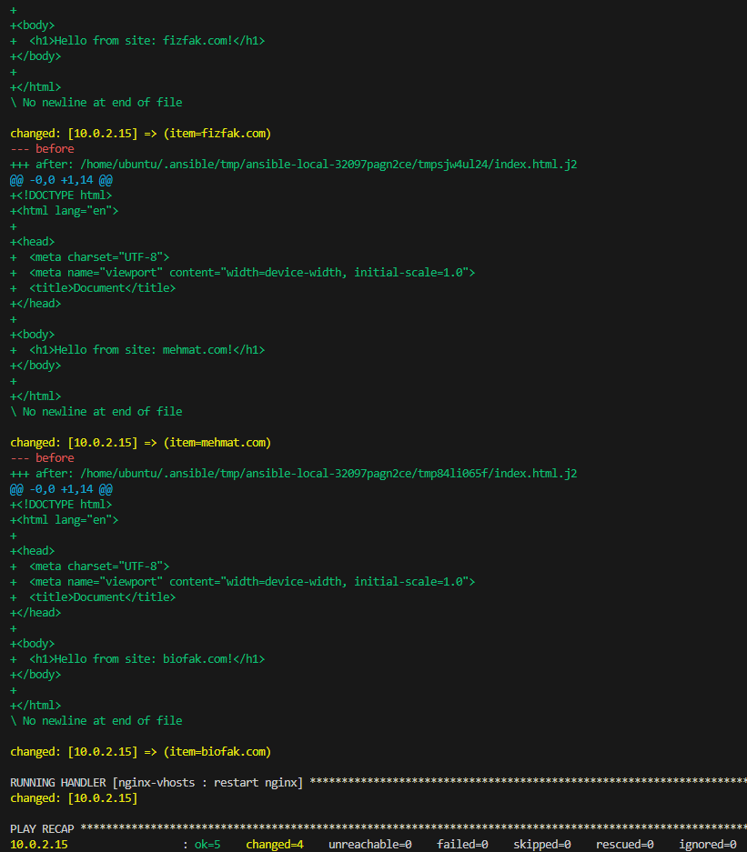
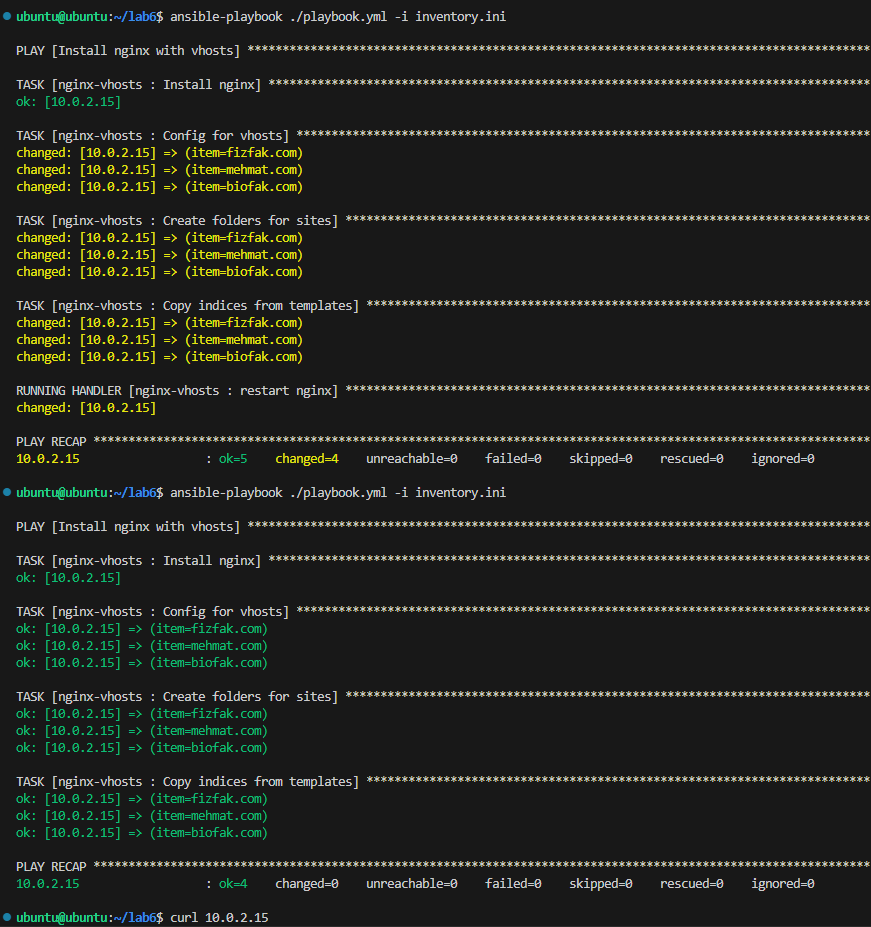
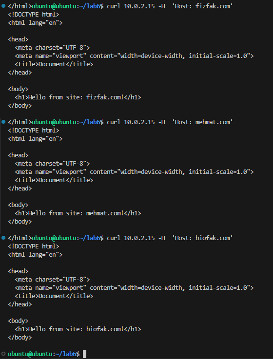

# Лаб 6. Ansible roles

## Было сделано

- Написан ansible инвентарь [inventory.ini](inventory.ini), хранящий хосты управляемых машин.
- Написан основной ansible плейбук целевых хостов [playbook.yml](playbook.yml) для проверки nmap'ом. 
- Написан ansible плейбук [playbook.yml](playbook.yml), в котором перечислены переменные и роли.
- Подготовлена роль nginx_vhosts. У ней прописаны:
  - Файл с описанием задач [tasks/main.yml](roles/nginx_vhosts/tasks/main.yml):
    - Установка nginx
    - Конфигурация виртуальных хостов на основе шаблона конфига
    - Создание директории для файлов html-страниц
    - Копирование/генерация html-страниц на машины с использованием j2-шаблонов
  - Хэнддер [handlers/main.yml](roles/nginx_vhosts/handlers/main.yml) для перезапуска nginx после установки нового конфига.
  - Шаблоны html-страницы nginx: [index.html.j2](roles/nginx_vhosts/templates/index.html.j2) и конфигруации nginx: [site.conf.j2](roles/nginx_vhosts/templates/site.conf.j2).

## Скриншоты:

**Выполнение плейбука**

**Повторное выполнение плейбука для проверки идемпотентности**

**curl запросы на виртуальные хосты**

